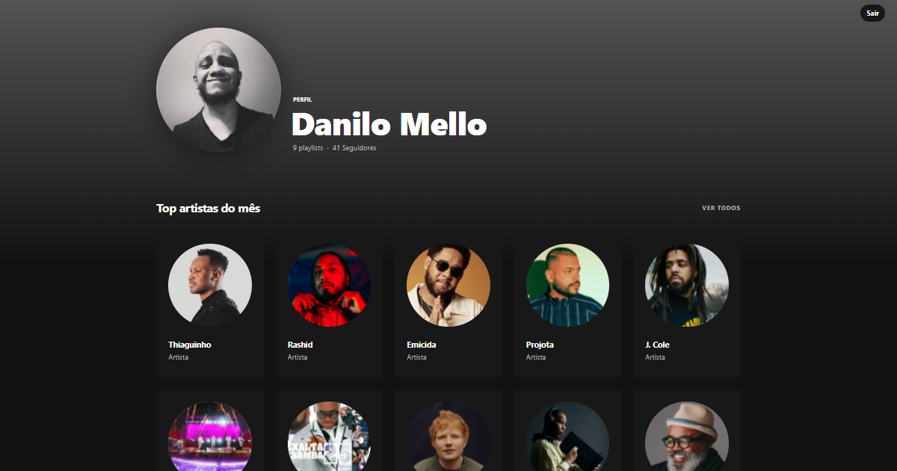

<h1 align="center">
    
</h1>

<br>

## 🧪 Tecnologias

Esse projeto foi desenvolvido com as seguintes tecnologias:

- [Node](https://nodejs.org/en/docs/guides/getting-started-guide/)
- [React](https://reactjs.org)
- [Styled Components](https://styled-components.com/)
- [Express](https://expressjs.com/pt-br/)
- [Spotify Api](https://developer.spotify.com/documentation/web-api/)

## 🚀 Como executar

Clone o projeto e acesse a pasta do mesmo.

```bash
$ git clone https://github.com/daniilomello/spotify-profile.git
$ cd spotify-profile
```

Para iniciá-lo, siga os passos abaixo:


```bash
# Crie uma conta no site do Spotify, inicie um novo aplicativo no dashboard.
https://developer.spotify.com/dashboard/applications

# Crie um arquivo .env adicione o client ID e client secret, 
# mostrado no dashboard, seguindo o exmplo do arquivo .env.example
CLIENT_ID=SEU-ID-AQUI
CLIENT_SECRET=SUA-SECRET-AQUI
REDIRECT_URL=http://localhost:8888
FRONTEND_URI=http://localhost:3000


# Adicione a url de callback na parte settings do seu app no dashboard do Spotify
http://localhost:8888/callback
```


```bash
# Instalar as dependências
$ yarn

# Iniciar o projeto
$ yarn start
```
O app estará disponível no seu browser pelo endereço http://localhost:3000.


## 💻 Projeto

Spotify Profile, é um app para você visualizar de forma personalizada seus dados de uso do Spotify, como número de seguidores, playlists, seus artistas mais ouvidos, e sua músicas mais ouvidas.


## 📝 License

Esse projeto está sob a licença MIT.

---

Feito com 💜 by Danilo Mello 👋🏻 